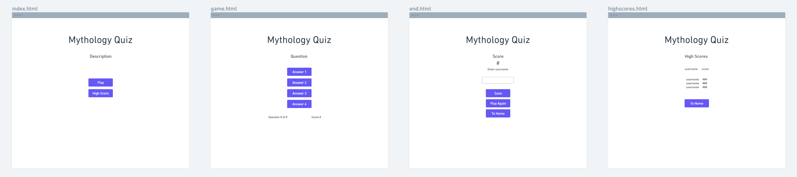
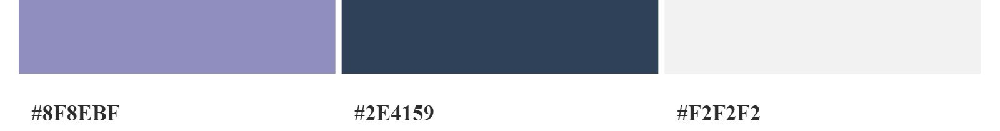
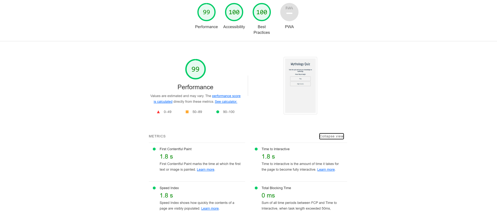

# Mythology Quiz

## Table of Contents

* [Description](#description)
* [User Stories](#user-stories)
* [Wireframe](#wireframe)
* [Am I Responsive](#am-i-responsive)
* [Features](#features)
* [Colors Used](#colors-used)
* [Testing](#testing)
* [Validator Testing](#validator-testing)
* [Bugs](#bugs)
* [Deployment](#deployment)
* [Credits](#credits)
* [Content](#content)

## Description

The Mythology Quiz tests the user on their knowledge of mythology from different cultures.
The user is given ten multiple choice questions with the option to choose from one of four answers. The results are tallied and shows the user how many questions they have answered correctly which is displayed under the questions and a final score when the quiz is completed.
The user can create a username and save their score at the end of the quiz. The score is saved locally. The quiz can be replayed again as many times as they like. The questions are displayed in random order so that each time the quiz is taken, the questions are not in the same order as the last.

## User Stories

* As a user, I would like to see a homepage, to see the description of the quiz
* As a user, I would like to answer a series multiple choice questions on mythology, so that I can test my knowledge
* As a user, I would like to save my score when I have finished the quiz, so that I can compare it with other scores
* As a user, I would like to view a high scores page, so that I can see if my score makes it to the top five

## Wireframe

## Am I Responsive

## Features
* Mythology Quiz heading
  * Located at the top of the quiz

* Question
  * Questions will be shown in a random order

* Answer
  * Four multiple choice answers to choose from.
  * After selecting an answer, a new question will appear.

* Question and score tally
  * Keeps track of what question the user is on and number of correct answers.

* Final score
  * When the quiz is finished, the final score is displayed.

* Username
  * User can enter their username.

* Save and Play again
  * Player can save their score and play the quiz again.

* High Scores
  * Top 5 highscores will be displayed along side the username.

## Colors Used

## Testing
* I confirm that this project is responsive, looks good and functions on all standard screen sizes using the devtools device toolbar.

## Validator Testing
* HTML
  * No errors were returned when passing through the official W3C validator
* CSS
  * No errors were found when passing through the official (Jigsaw) validator
* JavaScript
  * No errors were found when passing through the official Jshint validator
    * The following metrics were returned:
    ### game.js
    * There are 11 functions in this file.
    * Function with the largest signature take 2 arguments, while the median is 1.
    * Largest function has 12 statements in it, while the median is 3.
    * The most complex function has a cyclomatic complexity value of 5 while the median is 1.

    ### end.js
    * There are 3 functions in this file.
    * Function with the largest signature take 2 arguments, while the median is 1.
    * Largest function has 7 statements in it, while the median is 1.
    * The most complex function has a cyclomatic complexity value of 1 while the median is 1.

    ### highscores.js
    * There is only one function in this file.
    * It takes one argument.
    * This function contains only one statement.
    * Cyclomatic complexity number for this function is 1.

## Bugs
* Fixed
  * Could not display final score on the end page. Removed `#` on line 4 in end.js `('#mostRecentScore')`. Score now displays.
  * In deployed project, 404 error page continued to display when directing to a new page. I had to remove the forward slash in all the page links. Directing to a new page in the deployed project now works.

* Unfixed
  * No unfixed bugs

## Deployment
* The site was deployed to GitHub pages. The steps to deploy are as follows:
  * In the GitHub repository, navigate to the `Settings` tab
  * From the menu panel on the left, select `Pages`
  * From the source section drop-down menu, select the `Main` Branch then select `Save`
  * Once saved, the page will be automatically refreshed with a detailed ribbon display to indicate the successful deployment.

### The live link can be found here - https://bradleymurrell.github.io/Mythology-Quiz/

## Credits
* Simen Daehlin (Mentor)
  * Simen helped me implement the code in `game.js line 16 - line 46` so that the multiple choice questions from opentdb can be fetched. 

* Instructions on how to save and the display of highscores was taken from https://www.youtube.com/watch?v=f4fB9Xg2JEY

## Content
* Multiple choice questions sourced from https://opentdb.com/
* Wireframe created on https://whimsical.com/
* Color pallette created on https://color.adobe.com/
* Favicon created on https://favicon.io/
* Fonts sourced from https://fonts.google.com/