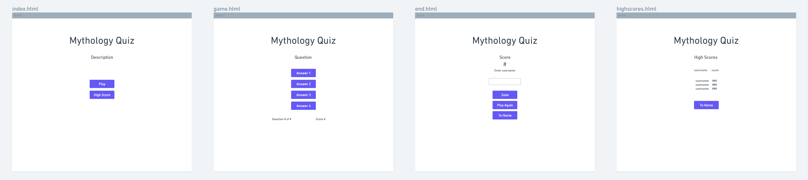
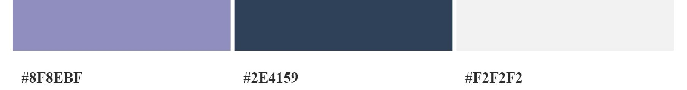

# Mythology Quiz

## Description

The Mythology Quiz tests the user on their knowledge of mythology from different cultures.
The user is given ten multiple choice questions with the option to choose from one of four answers. The results are tallied and shows the user how many questions they have answered correctly which is displayed under the questions and a final score when the quiz is completed.
The user can create a username and save their score at the end of the quiz. The score is saved locally. The quiz can be replayed again as many times as they like. The questions are displayed in random order so that each time the quiz is taken, the questions are not in the same order as the last.

## Wireframe

## Features
* Mythology Quiz heading
  * Located at the top of the quiz

* Question
  * Questions will be shown in a random order

* Answer
  * Four multiple choice answers to choose from.
  * After selecting an answer, a new question will appear.

* Question and score tally
  * Keeps track of what question the user is on and number of correct answers.

* Final score
  * When the quiz is finished, the final score is displayed.

* Username
  * User can enter their username.

* Save and Play again
  * Player can save their score and play the quiz again.

* High Scores
  * Top 5 highscores will be displayed along side the username.

## Colors Used

## Testing
* I confirmed that this project is responsive, looks good and functions on all standard screen sizes using the devtools device toolbar.

## Validator Testing
* HTML
  * No errors were returned when passing through the official W3C validator
* CSS
  * No errors were found when passing through the official (Jigsaw) validator
* JavaScript
  * No errors were found when passing through the official Jshint validator
    * The following metrics were returned:
    ### game.js
    * There are 11 functions in this file.
    * Function with the largest signature take 2 arguments, while the median is 1.
    * Largest function has 12 statements in it, while the median is 3.
    * The most complex function has a cyclomatic complexity value of 5 while the median is 1.

    ### end.js
    * There are 3 functions in this file.
    * Function with the largest signature take 2 arguments, while the median is 1.
    * Largest function has 7 statements in it, while the median is 1.
    * The most complex function has a cyclomatic complexity value of 1 while the median is 1.

    ### highscores.js

## Bugs
* Fixed
  * Could not display final score on the end page. Removed # on line 4 in end.js `('#mostRecentScore')`. Score now displays.

* Unfixed

## Deployment

## Credits